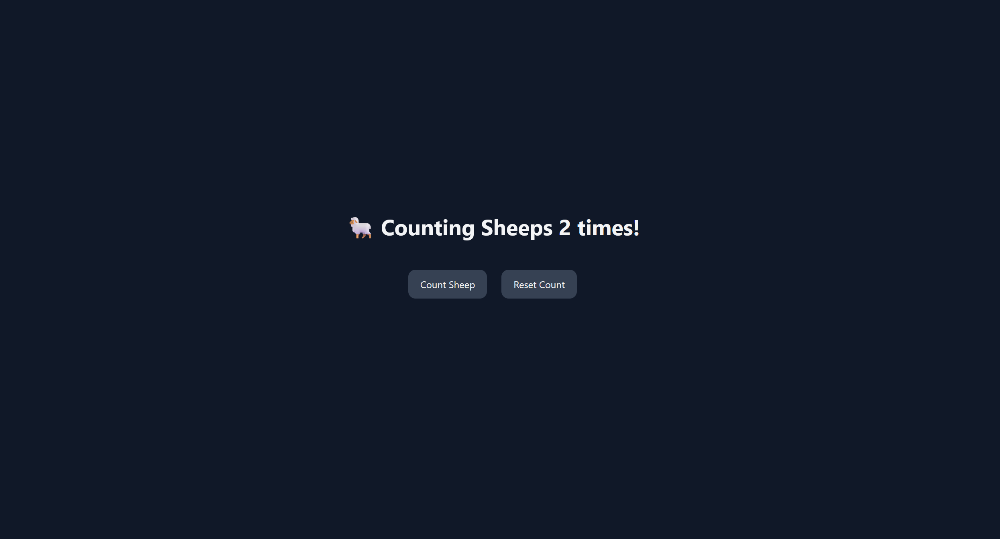

# Count Sheep

A simple Vite + React + TypeScript app that lets you count sheep.

## Demo

## Features

- Increment a counter by clicking a button.
- Reset the counter to zero.
- Dark mode support.

## Project Structure

- `src/`
  - `App.tsx` — The main application component.
  - `App.css` — Styles for the application.
  - `main.tsx` — The entry point of the application.
- `index.html` — The main HTML file.

## Learning Concepts

- React Hooks: `useState` for managing component state.
- Basic event handling in React.
- Styling with Tailwind CSS.

## Todo

- [ ] Add a visual representation of the sheep for each count (possibly animated).
- [ ] Add contraints to the counter:
  - [ ] Max sheep = 200
  - [ ] Disable button after 200
  - [ ] Show message: “You're asleep!”
  - [ ] Cannot go below 0
  - [ ] Reset re-enables button
- [X] Sheep auto-increments every second.
