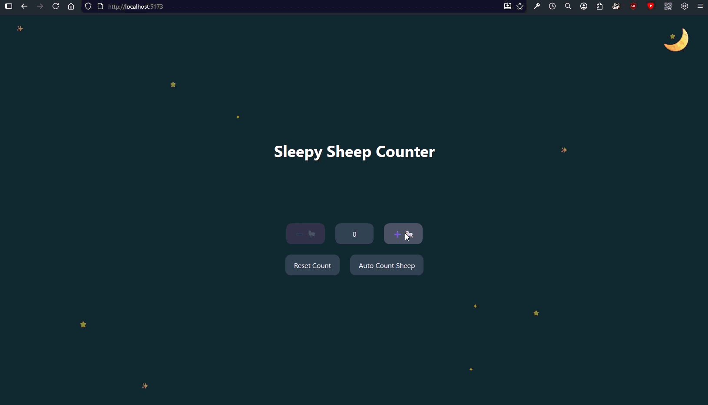

# Sleepy Sheep Counter

A simple Vite + React + TypeScript app that helps you count sheep to fall asleep.

## Demo

## Features

- Manually increment and decrement a sheep counter.
- Automatically count sheep every second.
- Reset the counter to zero.
- Visual feedback: The background darkens as more sheep are counted.
- Displays a sheep emoji for each count.
- The counter is constrained between 0 and 200.

## How to Run

1. Navigate to the `count-sheep` directory.
2. Install dependencies: `npm install`
3. Run the development server: `npm run dev`

## Learning Concepts

- React Hooks: `useState`, `useEffect`, and `useMemo`.
- Basic event handling in React.
- Using `setInterval` for automatic counting and managing it within `useEffect`.
- Guaranteed state updates using functional `set` operations.
- Dynamic and responsive styling with Tailwind CSS.

## Todo

- [X] Add a visual representation of the sheep for each count (possibly animated).
- [X] Add contraints to the counter:
  - [X] Max sheep = 200
  - [X] Disable button after 200
  - [X] Cannot go below 0
  - [X] Reset re-enables button
- [X] Sheep auto-increments every second
