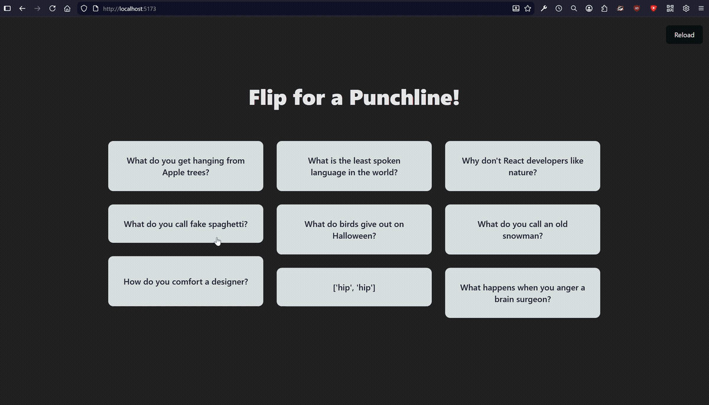

# React Joke Wall

A small Vite + React + TypeScript demo that fetches jokes from an external API and displays them in a responsive, masonry-style layout.

## Demo

## Features

- Fetches jokes from [https://official-joke-api.appspot.com](https://official-joke-api.appspot.com)
- Flip card UI for each joke (setup / punchline)
- Masonry-like layout using CSS columns

## Project Structure

- `src/`
  - `components/` — UI components (`JokeCard.tsx`, list components)
  - `models/` — TypeScript interfaces for `Joke`
  - `services/` — API functions (e.g. `fetchJokes()`)
  - `App.tsx` — app entry and data wiring
  - `App.css` — global styles and flip-card helpers

## Learning Concepts

- Asynchronous data fetching with `useEffect`
- Managing loading and error states with `useState`
- Separating concerns by keeping API calls in a dedicated `services` module
- Creating responsive layouts with CSS columns for a masonry effect
- Building modular UI with presentational components
