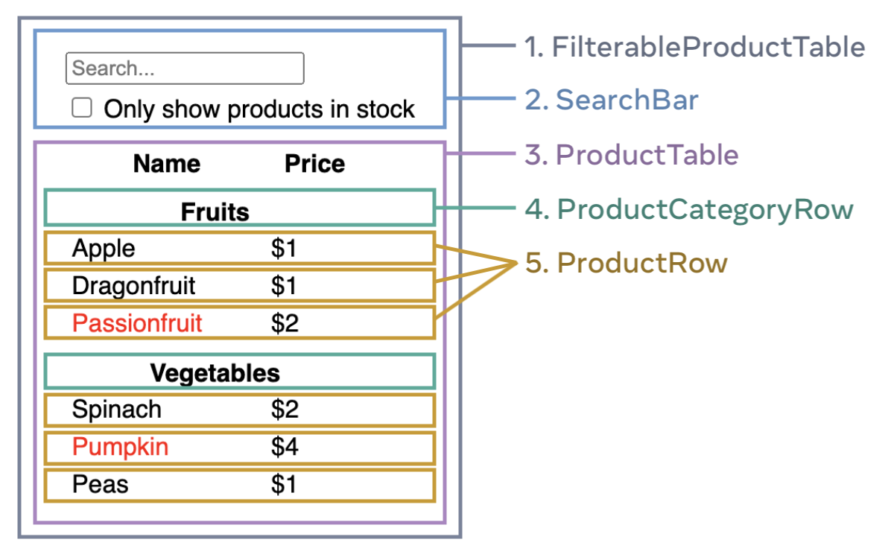

# Searchable data table
This app can display a basic table which can be serached. The design has 5 components:

1. `FilterableProductTable` (grey) contains the entire app.
1. `SearchBar` (blue) receives the user input.
1. `ProductTable` (lavender) displays and filters the list according to the user input.
1. `ProductCategoryRow` (green) displays a heading for each category.
1. `ProductRow`	(yellow) displays a row for each product.

## Installation
- Install Nodejs, if not installed already
- Use `git clone https://github.com/pratyakshajha/react-toy-projects.git` to clone this repository.
- Use `cd react-toy-projects` to switch directory
- Use `cd searchable-data-table` to switch to this project
- Run `npm install` to install dependencies

## How to run
- Use `npm start` to start the local server
- Got to `http://localhost:3000/` to view the app.

## To Do
- [ ] add some other data (from an API?)
- [ ] Prettify
- [ ] Add ability to sort