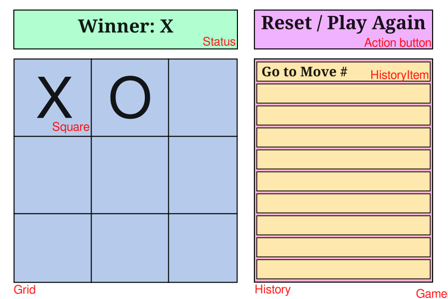

# Tic Tac Toe game
The design looks like:

## Installation
- Install Nodejs, if not installed already
- Use `git clone https://github.com/pratyakshajha/react-toy-projects.git` to clone this repository.
- Use `cd react-toy-projects` to switch directory
- Use `cd tic-tac-toe` to switch to this project
- Run `npm install` to install dependencies

## How to run
- Use `npm start` to start the local server
- Got to `http://localhost:3000/` to view the app.

## To Do
- [X] For the current move only, show “You are at move #…” instead of a button.
- [X] Rewrite Board to use two loops to make the squares instead of hardcoding them.
- [ ] When someone wins, highlight the three squares that caused the win (and when no one wins, display a message about the result being a draw).
- [ ] Display the location for each move in the format (row, col) in the move history list.
- [X] Add a refresh/reset button/play again
- [X] Play sound on win
- [X] Prettify

## References
- [tutorial-tic-tac-toe](https://react.dev/learn/tutorial-tic-tac-toe)